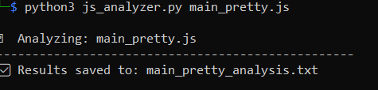
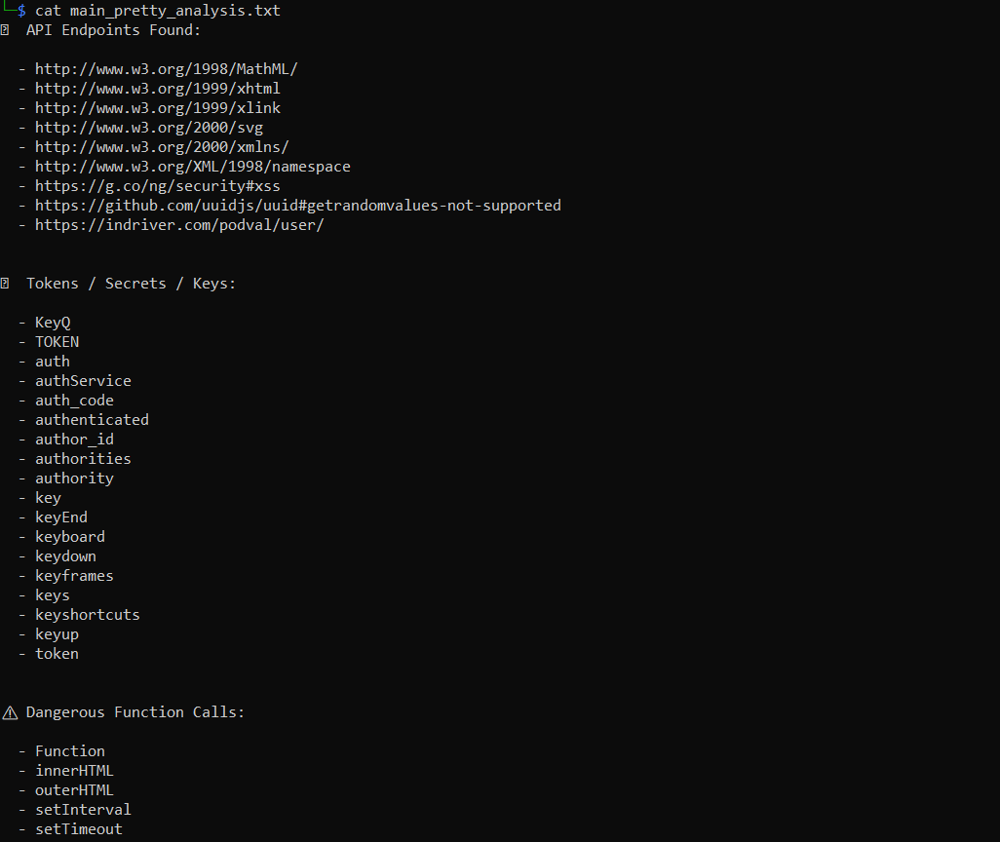

# 🔍 JS Analyzer

A lightweight Python tool to scan JavaScript files for:

- 🔗 API Endpoints  
- 🔐 Tokens / Secrets / Keys  
- ⚠️ Dangerous JavaScript Function Calls

---

## 📦 Features

- Regex-based analysis  
- Supports multiple `.js` files  
- Outputs readable report files  
- Useful for bug bounty hunters, pentesters, and developers

---

## 📥 Download JavaScript Files

Before scanning, you need to download the JavaScript file(s) you want to analyze.

You can use `wget` to fetch them directly in your terminal. Here's an example:

```bash
wget https://example.com/assets/main.js
```
---
## 🚀 Installation

Clone this repository:

```bash
git clone https://github.com/<your-username>/js-analyzer.git
cd js-analyzer

---
## Usage
python3 js_analyzer.py <file1.js> [file2.js] ...

##  Example:
python3 js_analyzer.py example/sample.js
```
📁 This creates ```sample_analysis.txt``` containing the results.

---

🧠 How It Works
The js_analyzer.py script is designed to quickly scan JavaScript files for potential security issues and useful recon data. Here's what it does under the hood:

1. 📂 File Input
Accepts one or more .js files as command-line arguments.

Non-JavaScript files are automatically skipped.

2. 🔍 Scans with Regex Patterns
The script reads each file and uses regular expressions to extract:

🔗 API Endpoints
Detects URLs like https://api.example.com.

🔐 Tokens, Secrets, and Keys
Flags variables commonly used to store sensitive data (e.g., auth_token, apiKey, jwt_secret).

⚠️ Dangerous JavaScript Function Calls
Identifies risky functions often abused in XSS and insecure coding patterns, such as:

eval()

document.write

innerHTML

outerHTML

setTimeout(Function)

new Function()

3. 📄 Report Generation
For each .js file scanned, the script creates a text file report named:
<filename>_analysis.txt

Each report contains neatly organized findings under three sections:

API Endpoints

Tokens/Secrets

Dangerous Function Calls

4. 📢 Terminal Feedback
After processing, the script prints a confirmation message showing where the result was saved.

🛠️ Requirements
Python 3.6+

No external libraries required

---

## 📸 Screenshot

Here is a sample output result:



>
